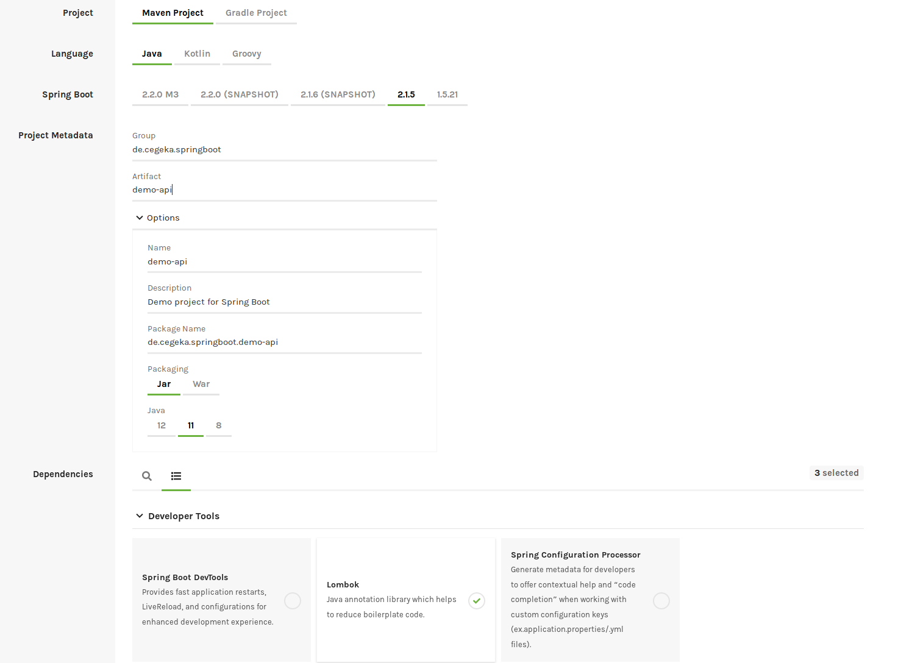

# Spring Boot Basics Workshop
## Links
- [Spring Boot Documentation](https://docs.spring.io/spring-boot/docs/current/reference/html/)
- [Spring Initializr](https://start.spring.io/) (Zum Schnellen Erstellen eines Spring Boot Services)
- [Spring Projects](https://spring.io/projects) (Überblick über alle Spring Projekte, u. a. Spring Boot, Spring Cloud)  

## Requirements
Following tools should be installed on the workstation:
- Developer IDE (e. g. Eclipse or IntelliJ) with Lombok support [Lombok](https://projectlombok.org/)
- Tool for testing REST calls (e. g. Postman)
- Tool for accessing databases (e. g. DBeaver) - optional
- Knowledge about at least Java 8 or higher

## New Project
Create a new project with the Spring Initializr:  
- Maven Project
- Java 8 / 11
- Dependencies:  
	- Spring Web Starter  
	- Spring Boot Actuator  
	- Lombok  

## Implementations (branch: step-01)
1. Import the project into the IDE and start the service  
	The endpoints "health" and "info" of the actuator should be available (*"/actuator/health", "/actuator/info"*)  
	([Spring Boot Actuator](https://docs.spring.io/spring-boot/docs/current/actuator-api/html/))  
2. Check the structure of the service and do the following changes:  
	a) Add the build-info for the "info" endpoint to the *pom.xml*  
	b) Delete unnecessary files (Scripts)  
3. Implement Controller (branch: step-02)  
    a) Initial Implementation (tag: step-02.1)  
    b) Implement Request- and Response Model (tag: step-02.2)  
    c) Add Configuration (tag: step-02.3)  
4. Implement Services (branch: step-03)  
5. Implement Error Handling and Logging (branch: step-04)  

## Unit Tests (branch: step-05)
1. Implement JUnit Tests
2. Add Mockito to the tests
3. Test with Spring Boot Context

## Add Dependencies
1. Swagger (branch: step-06)
2. Database Connection (branch: step-07)
3. Spring Web Security (branch: step-08)

## Annotations
Some more interesting and important annotations
- @PostConstruct
- @ComponentScan
- @Beans
- @PreDestroy
- @Slf4j
- @ConditionalOnProperty
- @EnableScheduling/@Scheduled
- [@Order](https://www.baeldung.com/spring-order)

## Hints
- When using **@Autowired** never use the **new** constructor, otherwise the object is **null**  
- If you use other properties than *application.properties*, you have define them explicit  
- The properties from *src/main/resources/* are not loaded on tests, you have to define own properties in *src/test/resources*  
 